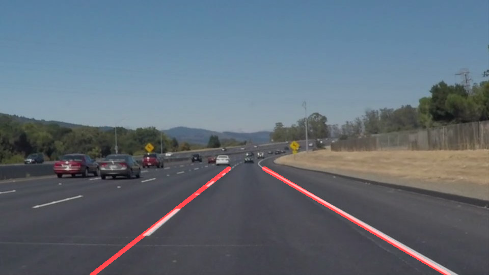

# **Finding Lane Lines on the Road** 



## Approach
The main aim of the project is to detect road lane markings. I followed below sequence of steps to build the pipeline:
* Noise removal
* Lane mask generation
* Edge detection
* Hough line detection
* Extrapolate lane markings
* Repeat above steps on each image sequence

### Noise removal
To remove sharp noise in image, 3x3 Gaussian kernel smoothing was applied to image. I have experimented with 5x5 kernel but it deteriorated the performance of lane mask generation and edge detection steps.

### Lane mask generation
Based on given test images lanes are marked as yellow or white. To generate the road lane masks, I experimented with different pixel threshold values in grayscale, RGB, YCbCr and HSV colorspaces. Pixel thresholding in RGB, HSV colorspaces provided good binary mask results compared to other colorspaces.

### Edge detection
I have used Canny edge detection algorithm with (20, 100) threshold values over lane binary mask. 

### Hough line detection
I have applied probabilistic hough transform algorithm on edge map to detect the line shapes. I have experimented with theta, minimum line size, rho and max line gap and threshold values. The hough vote count(threshold) and minimum line size values played key role in removing outliers. I ended up using below parameters for line detection.

```python 
	# Hough line detection algorithm parameters
    rho = 1
    theta = np.pi/180
    threshold = 30
    min_line_len = 30
    max_line_gap = 20
```

## Extrapolate lane markings
The Hough line detection algorithm helped to remove lot of edge outliers but produced lot of line points. In ideal world we would expect two line points which represents lane points. Now the challenge is to pick up best two line points which represent the lanes. I came up with following algorithm to detect best line pair which represents lane markings. From car camera point of view left and right lanes show up as parallel lanes which are going to meet at vanishing point.
- Eliminate line if its angle magnitue to the base is more that 70 degrees or less than 30 degrees . These numbers are derived based on both left and right lanes are going to meet at vanishing point.
- The line points are categorized into left or right based on angle direction. If it is positive it belongs to left lane, if it is right it belongs to right lane.
- I found multiple candidates for both left and right lanes. I selected one line from each category based on the minimum angle difference between pair of lines.
- I used line pair to extrapolate the line markings by finding the line intercepts and vanishing gradient points. 

## Results


## Limitations and Improvements
- The lane detection mechanism can be further improved by fusing results from HSV and RGB color spaces. I used only one colorspace for lane detection
- The algorithm is not robust for different weather conditions
- The Algorithm is very sensitive to colors and curvature of road
- Currently, I am selecting one line from left and right sets. This might cause false positives in real time scenario. This can be improved by using line fitting (RANSAC) techniques on all left and right line points.

## Conclusion
Overall, it was nice experience in building the lane detection pipeline. It reminded me of my computer vision course work in the past :)